# AI DevOps Copilot - Production PostgreSQL Entity Relationship Diagram (ERD)

This document provides the complete, production-grade database architecture schema for the **AI DevOps Copilot** platform.

---

## 1. High-Level Mermaid ER Diagram

```mermaid
erDiagram
    users ||--o{ refresh_tokens : "has active sessions"
    users ||--o{ servers : "provisions / created_by"
    users ||--o{ deployments : "triggers / deployed_by"
    users ||--o{ jenkins_builds : "triggers"
    users ||--o{ repositories : "created_by"
    users ||--o{ alerts : "assigned_to"
    users ||--o{ notifications : "receives"
    users ||--o{ ai_conversations : "owns"
    users ||--o{ audit_logs : "performed_by"

    servers ||--o{ docker_containers : "hosts"
    servers ||--o{ metrics : "emits"
    servers ||--o{ logs : "generates"
    servers ||--o{ alerts : "triggers_alert_on"

    repositories ||--o{ deployments : "deploys_source"
    repositories ||--o{ jenkins_builds : "triggers_build"

    deployments ||--o{ jenkins_builds : "associated_pipeline"

    docker_containers ||--o{ logs : "outputs_std_logs"

    alerts ||--o{ notifications : "generates_notification"

    ai_conversations ||--o{ ai_messages : "contains"

    users {
        string id PK "UUID v4"
        string email UK "Unique Index"
        string full_name
        string hashed_password
        string role "ADMIN | DEVOPS_ENGINEER | VIEWER"
        boolean is_active
        boolean is_verified
        boolean is_deleted
        datetime deleted_at
        string created_by_id FK
        string updated_by_id FK
        datetime created_at
        datetime updated_at
    }

    refresh_tokens {
        string id PK
        string user_id FK
        string token UK
        string token_family
        boolean is_revoked
        datetime expires_at
        string user_agent
        string ip_address
    }

    servers {
        string id PK
        string name UK
        string hostname
        string ip_address
        string environment "production | staging | development"
        string status "ONLINE | OFFLINE | MAINTENANCE | DEGRADED"
        string os_info
        integer cpu_cores
        integer ram_mb
        integer disk_gb
        string agent_version
        boolean is_deleted
        datetime deleted_at
        string created_by_id FK
        string updated_by_id FK
    }

    docker_containers {
        string id PK
        string container_id UK "64-char Docker SHA"
        string name
        string image
        string server_id FK
        string status "RUNNING | STOPPED | PAUSED | EXITED | RESTARTING"
        string ports_mapping
        float cpu_usage_pct
        float memory_usage_mb
        datetime started_at
        datetime finished_at
        boolean is_deleted
        datetime deleted_at
    }

    repositories {
        string id PK
        string name
        string full_name UK "org/repo_name"
        string git_url
        string default_branch
        string provider "GITHUB | GITLAB | BITBUCKET"
        boolean is_private
        string language
        boolean is_deleted
        datetime deleted_at
    }

    deployments {
        string id PK
        string deployment_code UK "DEP-1042"
        string service_name
        string environment "production | staging | development"
        string version
        string status "SUCCESS | DEPLOYING | FAILED | ROLLBACK | PENDING"
        string cluster
        string commit_hash
        string author
        string repository_id FK
        string deployed_by_id FK
        integer duration_seconds
        string rollback_version
        boolean is_deleted
        datetime deleted_at
    }

    jenkins_builds {
        string id PK
        string job_name
        integer build_number
        string branch
        string commit_sha
        string status "SUCCESS | BUILDING | FAILURE | ABORTED | UNSTABLE"
        string trigger_cause
        integer duration_ms
        string repository_id FK
        string deployment_id FK
        string triggered_by_id FK
        boolean is_deleted
        datetime deleted_at
    }

    logs {
        string id PK
        string source "system | nginx | postgresql | app | docker | kubernetes"
        string level "DEBUG | INFO | WARN | ERROR | CRITICAL"
        text message
        string service_name
        datetime timestamp
        string trace_id
        json metadata_json
        string server_id FK
        string container_id FK
    }

    metrics {
        string id PK
        string metric_name "cpu_usage_percent | memory_used_bytes | http_requests_per_sec"
        float value
        string unit
        datetime timestamp
        json tags
        string server_id FK
    }

    alerts {
        string id PK
        string alert_code UK "ALT-9041"
        string title
        string severity "CRITICAL | HIGH | MEDIUM | LOW | INFO"
        string status "ACTIVE | ACKNOWLEDGED | RESOLVED | SILENCED"
        string source
        text description
        datetime resolved_at
        string server_id FK
        string assigned_to_id FK
        boolean is_deleted
        datetime deleted_at
    }

    notifications {
        string id PK
        string user_id FK
        string title
        text message
        string type "INFO | ALERT | DEPLOYMENT | SECURITY"
        string channel "IN_APP | EMAIL | SLACK | WEBHOOK"
        boolean is_read
        datetime read_at
        string alert_id FK
    }

    ai_conversations {
        string id PK
        string title
        string user_id FK
        string model_used
        integer tokens_used
        boolean is_pinned
        boolean is_deleted
        datetime deleted_at
    }

    ai_messages {
        string id PK
        string conversation_id FK
        string sender "USER | ASSISTANT | SYSTEM"
        text content
        json suggested_action
        integer latency_ms
        datetime created_at
    }

    audit_logs {
        string id PK
        string action "USER_LOGIN | DEPLOYMENT_TRIGGERED | ROLE_UPDATED"
        string actor
        string target_resource
        text details
        string ip_address
        string user_agent
        json extra_metadata
        datetime timestamp
        string user_id FK
    }
```

---

## 2. Global Standards & Patterns

Every production table inherits from `ProductionAuditModel` (or `TimeStampedModel`), ensuring complete consistency:

1. **UUID v4 Primary Keys**: Non-sequential 36-character string representation (`uuid.uuid4()`) prevents enumeration vulnerabilities.
2. **Soft Delete (`is_deleted`, `deleted_at`)**: Standard across all domain objects (`users`, `servers`, `docker_containers`, `deployments`, `jenkins_builds`, `repositories`, `alerts`, `notifications`, `ai_conversations`, `audit_logs`).
3. **Audit Tracking (`created_by_id`, `updated_by_id`)**: Stores user FK who created/updated the row.
4. **Timezone-aware UTC Timestamps (`created_at`, `updated_at`)**: Automatic current time in UTC (`CURRENT_TIMESTAMP`).
5. **CHECK Constraints**: Strict SQL-level checks enforce valid enums (roles, statuses, severities) and positive numeric hardware properties (`cpu_cores > 0`, `ram_mb > 0`, `disk_gb > 0`).
6. **Composite Indexes**: Optimized for time-series aggregation and status filtering:
   - `logs`: `(source, level, timestamp)`, `(service_name, timestamp)`
   - `metrics`: `(metric_name, timestamp)`, `(server_id, metric_name, timestamp)`
   - `servers`: `(environment, status)`
   - `deployments`: `(environment, status)`
   - `notifications`: `(user_id, is_read)`
   - `audit_logs`: `(action, created_at)`, `(user_id, action)`
